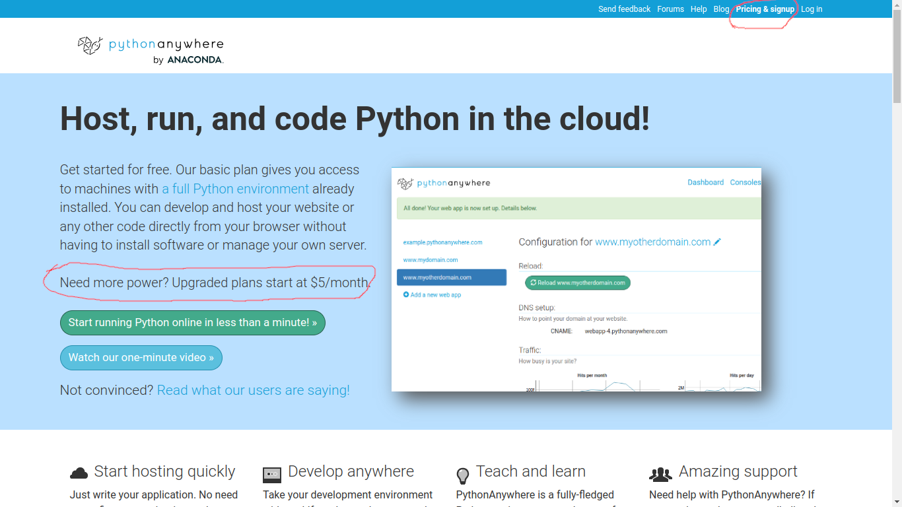
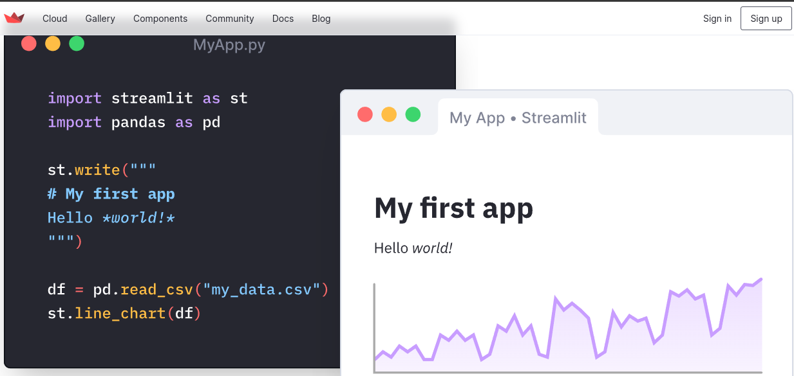
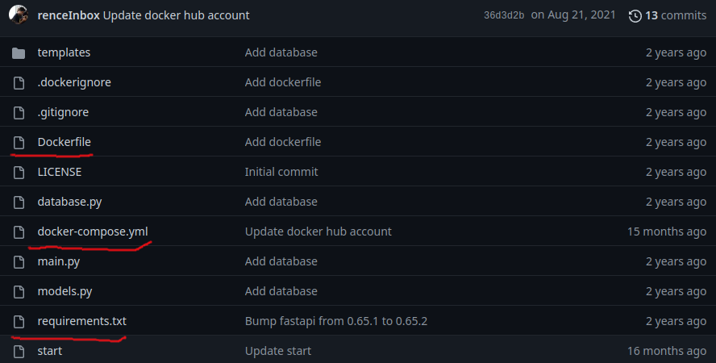
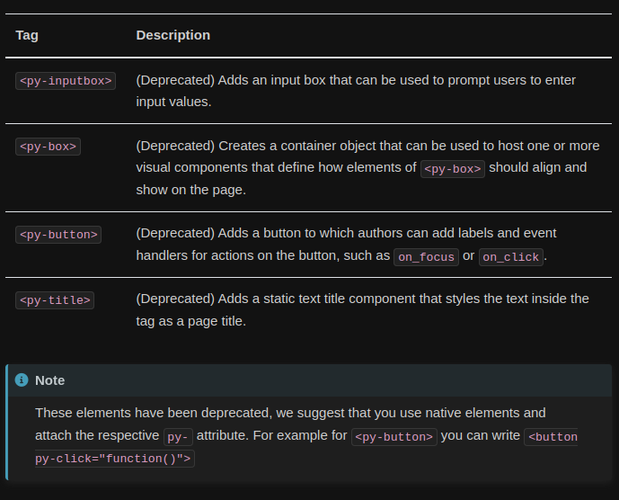
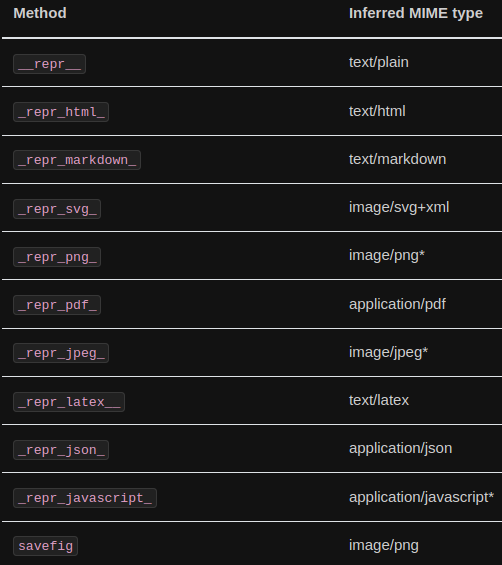

# Before we start

What are our needs?

>- We need at fast serveless solution.
>- With the basic scientific packages (numpy, scipy, pandas, matplotlib),
>- and at least some met/ocean specific packages like:
netCDF4 (**netcdf-c**, **hdf5**), geopandas (**geos**), cartopy (**proj**), cftime (**cyhton extension**), cf_units (**udunits2**), etc.

. . . 

Please keep this in mind as we navigate this presentation.


# Bit of history

Python on the web is not a new idea.
There were many, attempts with different degrees of success, in the past years.

# Running on a server

[https://www.pythonanywhere.com/](https://www.pythonanywhere.com/)



# Running on a server

[https://streamlit.io](https://streamlit.io)


## Cloud plans

[https://discuss.streamlit.io/t/what-happened-to-streamlit-cloud-plans/24894](https://discuss.streamlit.io/t/what-happened-to-streamlit-cloud-plans/24894)

# Running on a server

[https://htmx.org](https://htmx.org/examples)



## HTMX Project

[https://github.com/renceInbox/fastapi-todo](https://github.com/renceInbox/fastapi-todo)

# Transpilation

[https://www.transcrypt.org](https://www.transcrypt.org)

## Transcrypt {data-background-iframe="https://www.transcrypt.org"}

# In-browser re-implementation (failed live demos)

- [https://brython.info](https://brython.info/static_doc/en/interpreter.html)
- [https://skulpt.org](https://skulpt.org)

## Brython {data-background-iframe="https://brython.info/static_doc/en/interpreter.html"}
## Skulpt {data-background-iframe="https://skulpt.org"}

# Can we do better than transpiling to/or reimplementing in JS?

>- [Webassembly (Wasm)](https://webassembly.org/) is a binary instruction format for a stack-based virtual machine.
>- [Emscripten](https://emscripten.org/) is a compiler toolchain to WebAssembly.

. . . 

Wasm is the closest we ever got to a universal binary.

# (Maybe) some successful live demos

- [https://pypyjs.org](https://pypyjs.org)
- [https://pyodide.org](https://pyodide.org/en/stable/console.html)

## pypjs {data-background-iframe="https://pypyjs.org"}
## Pyodide {data-background-iframe="https://pyodide.org/en/stable/console.html"}

# Why is Pyodide a good option?

>- Based on Emscripten
>- Heavy download but fast execution
>- Full CPython + scientific distribution
>- Pure Python packages are installable
>- [Compiled packages can be added](https://github.com/pyodide/pyodide/pulls?q=is%3Apr+author%3Aocefpaf+is%3Aclosed)


# What else is missing?

We need to be able to:

>- Easily deploy Apps as HTML without compiling or downloading you own Pyodide
>- Control the installed packages
>- Choose the pyodide version
>- Access to the DOM and some JS &#8596; Python exchange
>- Some pre-built "web comfort" functions

# Enter PyScript

[https://pyscript.net](https://pyscript.net)


>- Builds on top of and manages pyodide
>- No installation required
>- Environment management

## pyscript {data-background-iframe="https://pyscript.net"}

# How to use it?


```html
<link rel="stylesheet" href="https://pyscript.net/latest/pyscript.css" />
<script defer src="https://pyscript.net/latest/pyscript.js"></script>
```

. . .

and a pyscript tag,

. . .

```html
<py-script> print('Hello, World!') </py-script>
```

# What is the difference between PyScript and Pyodide?


# Flexible config: control pyodide version

```html
<py-config>
  [[runtimes]]
  src = "https://cdn.jsdelivr.net/pyodide/v0.21.3/full/pyodide.js"
  name = "pyodide-0.21.3"
  lang = "python"
</py-config>
```

# Flexible config: modules and even local wheels

```html
<py-config src="./custom.toml">
  [[fetch]]
  files = ["./utils.py"]
  packages = [
      "numpy",
      "matplotlib",
      "./static/wheels/mypackage-0.1.3-py3-none-any.whl"
    ]
</py-config>
```


# PyScript: Labeled elements

```html
    <b><p>Today is <u><label id='today'></label></u></p></b>
    <br>
    <div id="pi" class="alert alert-primary"></div>
    <py-script>
      import datetime as dt
      pyscript.write('today', dt.date.today().strftime('%A %B %d, %Y'))

      def compute_pi(n):
          pi = 2
          for i in range(1,n):
              pi *= 4 * i ** 2 / (4 * i ** 2 - 1)
          return pi

      pi = compute_pi(100000)
      pyscript.write('pi', f'pi is approximately {pi:.3f}')
    </py-script>
```

## pi {data-background-iframe="htmls/pi.html"}

# Many built-in functionalities

But... Before we dive into that...


# Still under heavy-development




# Some of the built-in functionalities

```html
<div id="manual-write"></div>
<button py-click="write_to_page()" id="manual">Say Hello</button>
<div id="display-write"></div>
<button py-click="display_to_div()" id="display">Say Things!</button>
<button py-click="print_to_page()" id="print">Print Things!</button>
```

## click {data-background-iframe="htmls/button.html"}

# JavaScript to PyScript

```html
<script>
    name = "Guido" //A JS variable

    // Define a JS Function
    function addTwoNumbers(x, y){
        return x + y;
    }
</script>
```

. . . 

```html
<py-script>
    # Import and use JS function and variable into Python
    from js import name, addTwoNumbers

    print(f"Hello {name}")
    print("Adding 1 and 2 in Javascript: " + str(addTwoNumbers(1, 2)))
</py-script>
```

# PyScript to JavaScript

```html
<body>
    <py-script>x = 42</py-script>

    <button onclick="showX()">Click Me to Get 'x' from Python</button>
    <script>
        function showX(){
            console.log(`In Python right now, x = ${PyScript.globals.get('x')}`)
        }
    </script>
</body>
```

# display




# What can our community do with this?

## glider of the day {data-background-iframe="htmls/glider.html"}
## ioos_qc explorer {data-background-iframe="htmls/ioos_qc_browser.html"}
## ioos_qc csv uploader {data-background-iframe="htmls/ioos_qc_csv.html"}

# What if we cannot access the web?

[https://github.com/ocean-data-qc/ocean-data-qc](https://github.com/ocean-data-qc/ocean-data-qc)

# Summary

>- **Python in the browser**: Enable drop-in content, external file hosting, and application hosting without the reliance on server-side configuration (no subscriptions, no remote downtime, no data is exchanged)
>- **Python ecosystem**: Run many popular packages of Python and the scientific stack (such as numpy, pandas, scikit-learn, and more)

# Summary

- **Python with JavaScript**: Bi-directional communication between Python and Javascript objects and namespaces

>- **Environment management**: Allow users to define what packages and files to include for the page code to run
>- **Ship your app zero dependencies**
>- **Visual application development**: Use readily available curated UI components, such as buttons, containers, text boxes, and more

# Questions?

## {data-background-iframe="htmls/mario/play_mario.html"}
