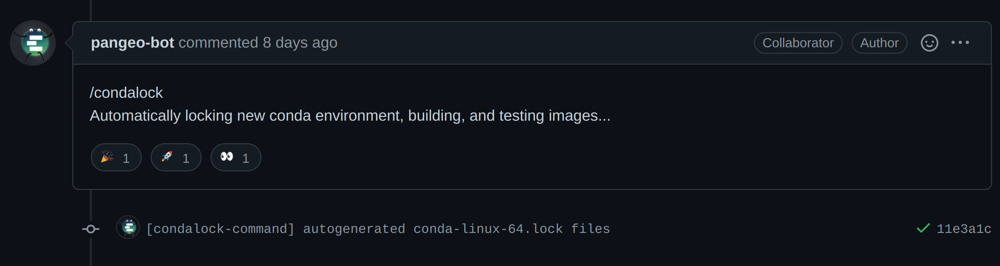

# Using GHA to:

>1. Setup a conda environment for Python testing.
>2. Setup a Python/pip environment for test.
>3. Build and publish documentation to gh-pages.
>4. Build, test, and publish source distribution and binary artifacts to PyPI.
>5. Build, test, cache, and publish a docker image.


# Quick review: CI-CD 1/3

- Continuous Integration (CI)
  - run tests at every code change.
  - perform schedule tests for downstream dependencies.

# Quick review: CI-CD 2/3

- Continuous Deployment (CD)
  - Publish documentation.
  - Test, and Publish tagged source distributions.
  - Build, test, and publish binary distributions.

# Quick review: CI-CD 3/3

- Most services did not integrated back with the code hosting platform.
- Awkward ways to handle secrets.


>- GHA changes that by making it asier to pass secrets and integrating with GH own services.

. . .

PS: the idea is not new. Gitlab CI already implemented most of this.

# Services are we using in the IOOS org?

- **Travis-CI**: for testing and building sites;
- **AppVeyor**: for Windows testing only;
- **AzurePipelines**: fast but not wasy to integrate with GH and required a huge amount of re-writing to make old tests work.


# Enter GHA


# Building workflows

- Create a `.github/workflows` directory in your repository on GitHub;
- Create an YAML file with the instructions for your workflow
- Add Actions from the [marketplace](https://github.com/marketplace?type=actions) or build your own.

# Warning

<section data-background-color="red">

The next slides will be terribly boring!
Even more so than the slides you've seen so far.
Viewer discretion is advised!!

I promise a cute image at the end.

</section>


# YAML all the way down


# Setup a conda environment

<section>


```yaml
name: Default Tests

on:
  pull_request:
  push:
    branches: [master]
```

#

```yaml
jobs:
  run:
    runs-on: ${{ matrix.os }}
    strategy:
      matrix:
        python-version: ["3.6", "3.7", "3.8", "3.9"]
        os: [windows-latest, ubuntu-latest, macos-latest]
      fail-fast: false
```

#

```yaml
    steps:
    - uses: actions/checkout@v2

    - name: Setup Conda
      uses: s-weigand/setup-conda@v1
      with:
        activate-conda: false
        conda-channels: conda-forge
```

#

```yaml
    - name: Python ${{ matrix.python-version }}
      shell: bash -l {0}
      run: |
        conda create --name TEST python=${{ matrix.python-version }} pip "libnetcdf<4.8.0" --file requirements.txt --file test_requirements.txt --strict-channel-priority
        source activate TEST
        pip install -e . --no-deps --force-reinstall

    - name: Conda Info
      shell: bash -l {0}
      run: |
        source activate TEST
        conda info --all
        conda list
```

#

```yaml
    - name: Default Tests
      shell: bash -l {0}
      run: |
        source activate TEST
        pytest -s -rxs -v -k "not integration" compliance_checker
```

</section>

# Setup a pip environment

```yaml
    - name: Setup python
      uses: actions/setup-python@v2

    - name: Install proj
      run: sudo apt-get install libgeos-dev libproj-dev

    - name: pip-tests
      run: |
        pytest -rxs tests
```

# Build and publish docs

<section>

```yaml
name: Build and Deploy docs
on:
  push:
    branches: [master]

    - name: Build environment
      shell: bash -l {0}
      run: |
         conda create --name IOOS --file .binder/conda-linux-64.lock
         source activate IOOS
```

#

```yaml
    - name: Build documentation
      shell: bash -l {0}
      run: |
        set -e
        source activate IOOS
        jupyter-book build jupyterbook

    - name: GitHub Pages action
      uses: peaceiris/actions-gh-pages@v3.6.1
      with:
        github_token: ${{ secrets.GITHUB_TOKEN }}
        publish_dir: jupyterbook/_build/html
```

</section>


# Build, test, and publish artifacts

<section>

```yaml
on:
  release:
    types:
      - published

    - name: Get tags
      shell: bash
      run: git fetch --depth=1 origin +refs/tags/*:refs/tags/*
```

#

```yaml
    - name: Build linux wheels
      uses: ./.github/workflows/actions/manylinux2014_x86_64

    - name: Check built artifacts
      working-directory: dist
      run: |
        python -m pip install wheel twine
        python -m twine check *

    - name: Upload built artifacts
      uses: actions/upload-artifact@v2
      with:
        name: pypi-artifacts
        path: dist
```

#

```yaml
  test-artifacts:
    needs: build-artifacts
    name: Test ${{ matrix.tag }} for Python ${{ matrix.python }}
```

#

```yaml
  publish-artifacts:
    needs: [build-artifacts, test-artifacts]
    name: Publish built artifacts to PyPI
    runs-on: ubuntu-latest
    steps:
      - name: Download built artifacts
        uses: actions/download-artifact@v2
        with:
          name: pypi-artifacts
          path: dist
```

#

```yaml
      - name: Publish artifacts
        uses: pypa/gh-action-pypi-publish@v1.4.2
        with:
          user: __token__
          password: ${{ secrets.PYPI_PASSWORD }}
```

# 

</section>

# Build, test, cache, and publish docker image

<section>

```yaml
    - name: Set up Docker Buildx
      uses: docker/setup-buildx-action@v1.5.1
```

#
```yaml
    - name: Cache Docker layers
      uses: actions/cache@v2.1.6
      with:
        path: /tmp/.buildx-cache
        key: ohw-docker-buildx-${{ github.sha }}
        restore-keys: |
          ohw-docker-buildx-
```

#
```yaml
    - name: Build Docker Image
      uses: docker/build-push-action@v2.6.1
      with:
        push: false
        tags: ${{ env.CONTAINER_NAME }}:PR
        cache-from: type=local,src=/tmp/.buildx-cache
        cache-to: type=local,dest=/tmp/.buildx-cache-new
        load: true
```

</section>

# CAVEATS

>- GHA does not run when you add the first workflow file via a PR.
>- Secrets are not accessible in PRs, for safety reasons, and that can make it hard to debug some workflow.
>- People outside the org team will require someone from the team to "Approve and run" the workflow. Thanks bitcoin miners!
>- The [marketplace](https://github.com/marketplace?type=actions) is awesome but the curation rules are not clear yet, there may be malicious Actions! Try to get the ones with most numbers of users and/or "Veryfied" by GitHub.

# Extras

Events that trigger workflows:

```yaml
on: [push, pull_request]
```
. . .

```yaml
on:
  schedule:
    - cron:  '30 5,17 * * *'
```

. . .

```yaml
on:
  repository_dispatch:
    types: [condalock-command]
```

# conda-lock



[Image from PR 235](https://github.com/pangeo-data/pangeo-docker-images/pull/235).

. . . 

For more info check the [GHA documentation](https://docs.github.com/en/actions/reference/events-that-trigger-workflows).


# Summary/links

1. [Setup a conda environment for Python testing](https://github.com/ioos/compliance-checker/blob/master/..github/workflows/default-tests.yml).
3. [Setup a Python/pip environment for test](https://github.com/SciTools/cf-units/tree/main/.github/workflows).
2. [Build and publish documentation to gh-pages](https://github.com/ioos/ioos_code_lab/blob/master/.github/workflows/deploy-docs.yml).
4. [Build, test, and publish source distribution and binary artifacts to PyPI](https://github.com/pyoceans/python-oceans/blob/master/.github/workflows/pip-tests.yml).
5. [Build, test, cache, and publish a docker image](https://github.com/oceanhackweek/jupyter-image/blob/master/.github/workflows](https://github.com/oceanhackweek/jupyter-image/blob/master/.github/workflows)).

# Questions?

